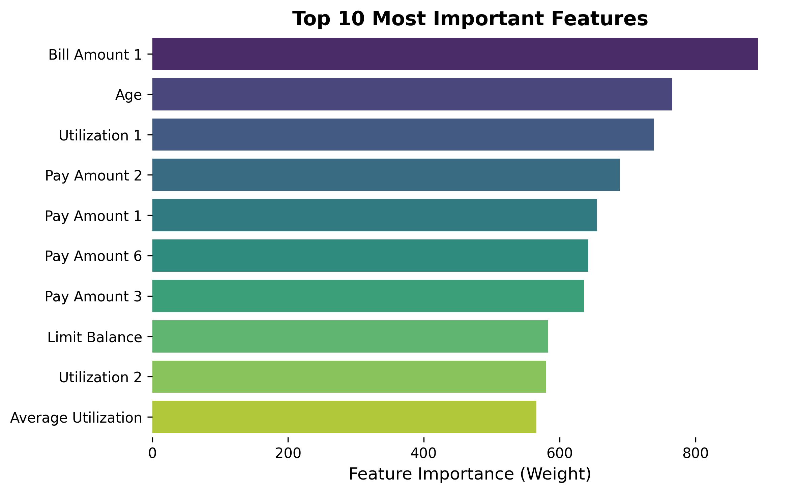
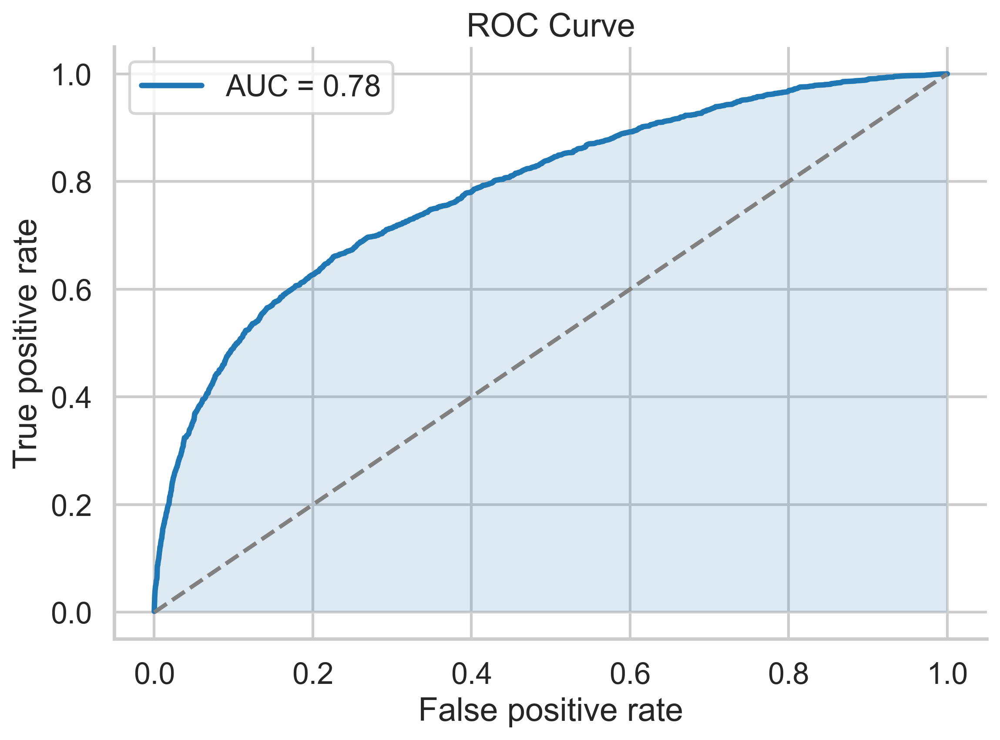
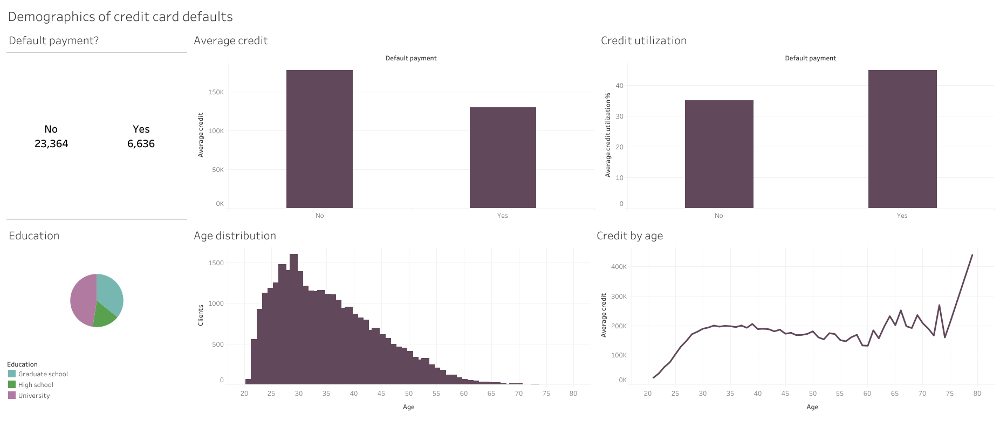

## Introduction
My objective is to train a machine learning model that predicts credit card default risk from financial and demographic customer data. I focus on XGBoost models, contrasting different hyperparameter settings and weights. I also engineer features from original data that I hypothesize will yield greater predictive power. Lastly, I compare the performance of the optimal model against logistic regression and random forest machine learning models as benchmarks.

These models are trained on the [Default of Credit Card Clients dataset](https://doi.org/10.24432/C55S3H) maintained by the [UC Irvine Machine Learning Repository](https://archive.ics.uci.edu/).

An interactive dashboard with the most important features explaining default risk is available on [Tableau](https://public.tableau.com/app/profile/braulio.assis/viz/Dashboard_17654917331560/Dashboard1).

## Methods
I build XGBoost models on python using the pandas, scikit-learn, and xgboost libraries, and I evaluate model performance focusing on recall rates of credit card default cases, as well as ROC-AUC scores. To visualize feature importances and ROC curves, I use matplotlib.

## Results
### Model 1
I start with a standard XGBoost model (500 estimators, max depth of 4, learning rate of 0.05, and 80% sampling of cases and features). This model showed high overall accuracy (82%), but a low recall rate of credit card default cases (38%).
```
Classification report:
               precision    recall  f1-score   support

           0       0.84      0.94      0.89      7009
           1       0.66      0.38      0.48      1991

    accuracy                           0.82      9000
   macro avg       0.75      0.66      0.68      9000
weighted avg       0.80      0.82      0.80      9000
```
This is likely a consequence of the imbalance between no-default and default cases in the training data (~3.52:1).

### Model 2
Due to this data imbalance, I build a second model that assigns a weight of ~3.52 to the outcome variable. This model had reduced overall accuracy (76%), but a significantly higher recall rate for credit card default cases (63%).
```
Classification report:
               precision    recall  f1-score   support

           0       0.88      0.80      0.84      7009
           1       0.47      0.63      0.54      1991

    accuracy                           0.76      9000
   macro avg       0.68      0.71      0.69      9000
weighted avg       0.79      0.76      0.77      9000
```
Given that my objective is to correctly identify credit card default risk, I will favor model 2 that has a higher recall rate for credit card defaults (true positives) than model 1, which has higher overall accuracy but a higher false negative rate.

Afterwards, I attempt to improve model 2 using hyperparameter tuning. Here, I test combinations of different number of estimators, tree depths, learning rates, and subsampling of cases and features. However, the optimal hyperparameter tuning resulted in no improvement on the model's recall rate for credit card default.

### Model 3: Credit utilization rate
I then engineer a new "utilization rate" feature, hypothesizing that customers that utilize a higher proportion of their available credit would be associated with a higher risk of default. Utilization rate was calculated as the ratio of the customers' monthly balance and their credit limit, for each of the six months that data is available for. Additionally, I created an "average utilization" feature that is the average utilization rate across the six months. While utilization rate on the first month ranked as the third most important feature in the model, these modifications did not improve credit card default recall rate (62%).


Figure 1: Most important features in predicting credit card defaults.


Figure 2: Receiver Operating Characteristic curve showing the trade-off between sensitivity (true positive rate) and specificity (false positive rate) across thresholds, along with the Area Under the Curve (AUC) score.

### Performance against benchmark models

The random forest model had a much lower recall rate for credit card default cases.
```
Classification Report:
               precision    recall  f1-score   support

           0       0.84      0.95      0.89      7009
           1       0.65      0.34      0.45      1991

    accuracy                           0.81      9000
   macro avg       0.75      0.65      0.67      9000
weighted avg       0.80      0.81      0.79      9000
```
Surprisingly, the logistic regression model had an equivalent recall rate for credit card default cases than the optimal XGBoost model (63%). However, the logistic regression model had lower overall accuracy than the XGBoost model (70% vs. 76%).

```
Classification Report:
              precision    recall  f1-score   support

           0       0.87      0.72      0.79      7009
           1       0.39      0.63      0.48      1991

    accuracy                           0.70      9000
   macro avg       0.63      0.67      0.63      9000
weighted avg       0.77      0.70      0.72      9000
```

## Conclusion
With an XGBoost machine learning model, we were able to predict 63% of credit card default cases based on financial and demographic data.


Interactive dashboard available on [Tableau](https://public.tableau.com/app/profile/braulio.assis/viz/CC-default/Dashboard1).
